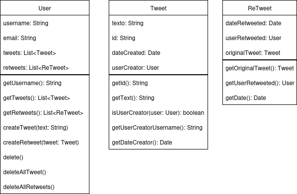

# Mini Twitter - TP Individual

## Autor
**Agustín Fernández Gómez**

---

## Consigna

**Universidad Nacional de Río Negro**  
Taller de Tecnologías y Producción de Software  
Lic. En Sistemas

### Trabajo Práctico General

Vamos a construir una versión muy simplificada de Twitter con una arquitectura monolítica de back-end. El back-end y el front-end son aplicaciones separadas que se comunican vía servicios web.

### Requerimientos a modelar

1. Cada usuario conoce todos los Tweets que hizo.
2. Un tweet puede ser re-tweet de otro, y este tweet debe conocer a su tweet de origen.
3. Un re-tweet no tiene texto adicional.
4. Los tweets de un usuario se deben eliminar cuando el usuario es eliminado. No existen tweets no referenciados por un usuario.
5. No se pueden agregar dos usuarios con el mismo userName.
6. userName no puede ser menor a 5 caracteres ni mayor a 25.
7. Los tweets deben tener un texto de 1 carácter como mínimo y 280 caracteres como máximo.
8. No se debe permitir crear un re-tweet de un tweet creado por el mismo usuario que re-twittea.

### Se pide

1. Modelar en objetos.
2. Escribir test unitarios.
3. Mapear para persistir y generar los servicios de backend.
4. Escribir test de integración usando una BD en memoria.
5. Exponer los servicios de backend como Servicios Web.
6. Escribir test de integración de la capa Web.
7. Lograr cobertura alta (>= 90%).
8. Implementar el front-end cuya navegabilidad se describe más adelante.

---

## Cómo ejecutar (local)

El proyecto usa Apache Derby como base de datos en modo servidor/cliente por defecto. A continuación las instrucciones mínimas para levantar la DB y la aplicación.

1) Descargar Apache Derby (si no lo tienes):
   - Descarga binario desde: https://db.apache.org/derby/derby_downloads.html
   - Descomprime, por ejemplo en: `~/Descargas/db-derby-10.17.1.0-bin`

2) Iniciar el servidor de red de Derby (puerto 1527 por defecto):

Si descargaste y descomprimiste en `~/Descargas/db-derby-10.17.1.0-bin`, arrancalo con:

```bash
# desde la carpeta descomprimida (o indicando la ruta completa al derbyrun.jar)
java -jar ~/Descargas/db-derby-10.17.1.0-bin/derbyrun.jar server start
```

Deberías ver un mensaje indicando que Derby arrancó y está escuchando en el puerto 1527. Verificá con:

```bash
ss -ltnp | grep 1527
```

3) Credenciales y URL de conexión usadas por la aplicación:

- JDBC URL (cliente): `jdbc:derby://localhost:1527/ejemplo;create=true`
- Usuario: `app`
- Password: `app`

4) Clase `Main` para poblar la BD y ejecutar ejemplos

- La clase recomendada para poblar la BD con datos de ejemplo es `unrn.model.Main`. Ejecutala una vez con Derby corriendo para insertar usuarios, tweets y retweets de ejemplo.

5) Ejecutar la aplicación (opciones):

- Opción A — Ejecutar desde IntelliJ/Eclipse: crear una configuración de "Application" apuntando a la clase `unrn.model.Main` (o `unrn.model.Application` / `unrn.model.ClassicEmf` si preferís) y correrla. `Main` crea datos de ejemplo.

- Opción B — Ejecutar con Maven (invoca la clase `Main`):

```bash
mvn org.codehaus.mojo:exec-maven-plugin:3.1.0:java -Dexec.mainClass="unrn.model.Main"
```

- Opción C — Ejecutar el backend Spring Boot (levanta contexto web y APIs):

```bash
mvn org.springframework.boot:spring-boot-maven-plugin:3.2.4:run
```

> Nota importante: si ejecutás `spring-boot:run` el servidor Derby debe estar activo (paso 2). Si no, Hibernate intentará conectarse y fallará con "Connection refused".

---

## Tecnologías usadas

- Java 17 (compatibilidad con OpenJDK 17)
- Maven para build y gestión de dependencias
- Apache Derby (modo servidor/cliente) como base de datos para desarrollo local
- Hibernate (Jakarta Persistence) para ORM / mapeo JPA
- Spring Boot (Web, Data JPA) para exponer API REST y wiring
- JUnit 5 + Mockito/Hamcrest para tests unitarios e integración
- React (Vite) para front-end (aplicación cliente separada)

---

## CORS / Conexión desde front-end

El front (por ejemplo corriendo en `http://localhost:5173`) consume las rutas REST expuestas por este backend en `http://localhost:8080/api/...`.
Si el front hace peticiones cross-origin, habilitá CORS en la app (ya hay una configuración en `unrn.model.config.CorsConfig`).

---


## Datos de ejemplo

La clase `unrn.model.Main` añade algunos usuarios y tweets (temática nórdica) y crea retweets de ejemplo. Ejecutala una vez con Derby corriendo para poblar la base.

---

## Tests

- Para compilar y ejecutar tests:

```bash
mvn -U clean test
```

- Para ejecutar sólo la suite de integración (si están separados por perfiles o naming): ajustar el comando según la configuración del proyecto.

---

## Notas y consejos

- Si ves errores de conexión con Derby (Connection refused), comprobá que el servidor de red esté iniciado y que el puerto 1527 esté accesible.
- Para tests locales se puede configurar una BD en memoria: `jdbc:derby:memory:ejemplo;create=true`.

---

## Modelo de Objetos

> El siguiente diagrama representa el modelado de objetos principal del sistema (User, Tweet, ReTweet). Puedes visualizarlo directamente aquí:



---

> Trabajo Práctico General - Mini Twitter  
> Universidad Nacional de Río Negro - Lic. en Sistemas  
> Autor: Agustín Fernández Gómez
